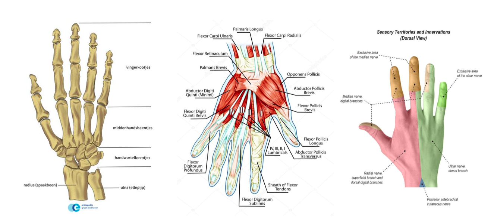
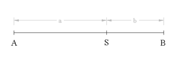
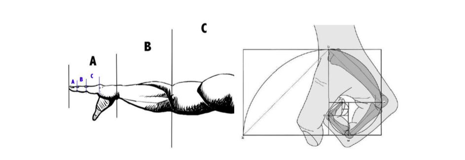

\pagebreak
# Anatomie van de hand
Handen zijn uiterst belangrijk voor de mens, omdat mensen met de hand in staat hun omgeving te manipuleren en ook essentiële levensbehoeften vervullen, zoals eten en drinken. Handen zijn erg kenmerkend voor de mens. De menselijke hand wijkt erg af van wat vele dieren hebben.

De menselijke hand wordt gekenmerkt door opponeerbare duimen, wat betekent dat mensen met het topje van hun duim hun andere vingers aan kunnen raken. Bij veel dieren is dit niet het geval.

{ #fig:anatomie width=100% }

## Beenderen
De hand bestaat wel uit 27 kleine botjes @natuurinformatie. De botjes zorgen ervoor dat de handen, en met name de vingers ervan, erg beweegbaar zijn. De duim kan wel 90 graden worden gedraaid, in tegenstelling tot de andere vingers. Deze kunnen ongeveer 45 graden worden gedraaid.

De onderarm eindigt met de ellepijp en het spaakbeen. Hier gaat het over naar de pols, deze bestaat uit acht handwortelbeentjes. Hier zijn alle vingers aan bevestigd. Boven de handwortelbeentjes, in de middenhand, bevinden zich de middenhandsbeentjes. Dit maakt de pols beweegbaar, zodat het makkelijker is om voorwerpen vast te grijpen. De vingers bestaan uit vingerkootjes. Bij elke vinger zijn dit er drie, behalve de duim, deze heeft er twee. Hierdoor is een vinger in drie delen te krommen. In de geneeskunde en anatomie worden deze vingers vaak aangeduid met romeinse cijfers. Dit loopt van digitus I (de duim) tot digitus V (de pink), zoals ook gebruikt in @alpenfels1955.

## Spieren en pezen
De spieren in de hand worden verdeeld onder twee soorten: de intrinsieke en extrinsieke banden. Intrinsieke banden zijn kort en stijf en bevinden zich vooral in de handpalm. Deze spieren hoeven namelijk niet sterk uit te rekken. Extrinsieke banden zijn soepeler en een stuk langer. Zij verbinden de onderarmbotten met de middenhandsbeentjes, @mortele2009. Wanneer deze worden aangespannen, buigen de vingers.

Ook bevindt het CMC-gewricht, @oosterbos, zich in de hand. Dit gewricht maakt het mogelijk de duim in oppositie te bewegen, dit betekent dat de duim naar de pink wordt bewogen. Hierdoor kan men de duim in veel meer verschillende posities houden dan de andere vier vingers. Dit maakt de menselijke hand ook zo complex.

In de hand bevinden zich ook pezen die het te ver terugbuigen van de vingers voorkomen. Als deze er niet waren, zouden de vingers makkelijk de verkeerde kant op buigen, hetgeen zorgt voor het scheuren van andere spieren.

## Zenuwen en aderen
De hand is voorzien van drie gemengde zenuwen: de nervus ulnaris, nervus medianus en nervus radialis. Deze zenuwen sturen de spieren in de hand en onderarm aan. De zenuwen hebben alle drie zowel motorische (‘bewegende’) als sensibele (‘voelende’) functie. Deze sensibele functie laat een hoge haptische waarneming toe, wat betekent dat je erg veel kan voelen met de hand. Bijvoorbeeld druk-, bewegings- en vibratiestimulansen. De bloedtoevoer wordt verzorgd door twee slagaders: de arteria radialis en arteria ulnaris.

## Gouden ratio in de anatomie van de hand
De gouden ratio of gulden snede is een speciale wiskundige verdeling van een lijnstuk. De gouden ratio is al vanaf de oudheid bestudeerd. Dit omdat het vaak in de natuur voor blijkt te komen. De gouden ratio op lijnstuk AB (@fig:lijn) met punt S als de gouden ratio is te definiëren als:

$$ \phi_{1} = \frac{1+\sqrt{5}}{2} \approx 1,618\dots $$
@guldensnede

Dit ratio blijkt massaal voor te komen in de natuur. De gouden ratio wordt door velen gezien als de meest esthetische verhouding in zowel kunst, natuur en design, benoemd in @osborn1999. In de natuur kan men denken aan de groente romanesco en verschillende bloemblaadjes.

{ #fig:lijn width=36% }

Maar ook in de anatomie blijkt de gulden snede voor te komen. Bijvoorbeeld in de arm. Zie @fig:goudenanatomie. Onze vingers bestaan uit 3 delen. De eerste twee delen (blauwe B en C in figuur 7). Zijn in gouden ratio met de totale lengte van de vinger. Ook staan de middelvinger en pink in deze verhouding met elkaar. @murali2012.

{ #fig:goudenanatomie width=100% }

De rij van Fibonacci houdt sterk verband met de gulden snede. Deze interessante reeks begint met 0 en 1, waarbij elk volgend element de som van beiden elementen hiervoor is. Dit geeft voor de eerste tien getallen de volgende reeks:

$0, 1, 1, 2, 3, 5, 8, 13, 21, 34 \dots$
@fibonacci

Als men dit vervolgens plot op een (oneindig) rechte lijn, is het gouden ratio duidelijk te visualiseren. Ook nadert de reeks het gouden ratio als zijnde een limiet.
