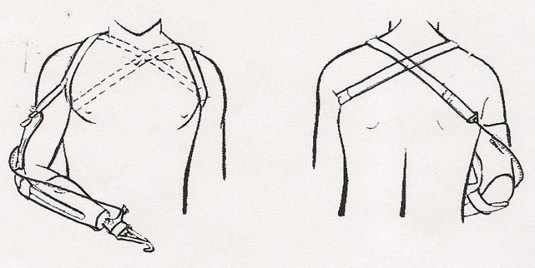
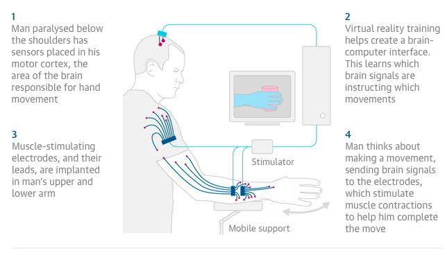

\pagebreak
# Hedendaagse protheses
Protheses zijn een erg goede vervanging voor ledematen die zijn beschadigd bij mensen of zelfs missen. Dit geldt voor erg veel delen van het lichaam, die elk kort zullen worden behandeld.
Er bestaan verschillende soorten protheses. Van simpele nabootsingen van het desbetreffende ledemaat tot volledig robotisch aangedreven protheses. Voor organen bestaan er ook protheses, dit worden meestal implantaten genoemd, omdat de prothese helemaal is weggewerkt in het lichaam.
@arduino, @advancer

## Soorten Protheses
Je hebt veel verschillende soorten protheses, bijvoorbeeld een beenprothese, borstprothese, armprothese, oogprothese, voetprothese en handprothese. Ook zijn er hele bekende protheses, die in de volksmond geen protheses meer worden genoemd. Denk aan een gehoorprothese (gehoorapparaatje), een oogprothese (bril of lenzen) en tandprotheses (kunstgebit). Elk van de eerdergenoemde protheses heeft een ander doel en worden dus ook op een andere manier gemaakt, en meestal ook met andere materialen.

### Beenprothese {.unnumbered}
In de categorie beenprotheses bestaan er ook verschillende protheses, zo is er een voetprothese, een onderbeenprothese met eventueel een vervangende enkel, een bovenbeenprothese met een vervangende knie en enkel en een totale beenprothese. Bij een amputatie onder de knie wordt een onderbeenprothese het meeste toegepast. De onderbeenprothese bestaat uit een koker die de stomp (waar de amputatie is verricht) nauwsluitend omvat. De koker staat weer in verbinding met een prothesevoet, met eventuele adapters. Er zijn veel verschillende soorten prothesevoeten, hele simpele prothesevoeten, van simpel materiaal, tot prothesevoeten van veerkrachtig materiaal die de energie van een stap opslaan om die te gebruiken als je je weer afzet voor krachtigere stappen. Ook bestaan er volledige mechanische beenprotheses, werkend met meerdere microcontrollers. Een totale beenprothese wordt pas aangeraden als er een totale beenamputatie heeft ondervonden. Het principe is hetzelfde als hierboven is beschreven bij de onderbeenprotheses, alleen is er nu nog een extra koker, voor het bovenbeen en een knie. De kunstknie heeft een belangrijke taak, namelijk voorkomen dat de kokers onbedoeld kunnen buigen en de gebruiker omvalt. Er zijn hiervoor speciale kunstknie&#235;n ontworpen met een hydraulische of pneumatische vertraging, bij hele geavanceerde knie&#235;n wordt het bijna elk aspect van een stap elektronisch geregeld.

### Implantaat {.unnumbered}
Een implantaat is een prothese dat helemaal is weggewerkt in het lichaam (Implantaat, z.j.). Enkele voorbeelden hiervan zijn een hart-, heup- en knie-implantaat. Ook zijn er bijvoorbeeld elektrische implantaten, zoals pacemakers of een implanteerbare cardioverter-defibrillator. De cardioverter-defibrillator kan een elektrische schok geven aan het hart als het een ritmestoornis heeft. Dit zijn enkele voorbeelden van implantaten.

### Armprothese {.unnumbered}
Ook bij armprotheses bestaan er verschillende soorten protheses. Van vingerprotheses tot volledige arm protheses. De meest gebruikte techniek om een armprothese te laten passen is om nadat de stomp een stabiel volume heeft gekregen er een gipsafdruk van te maken. Daaraan wordt er een stompkous gemaakt die om de stomp heen past en die men vast kan maken aan de prothese (Armprothese, z.j.). Een van de vereiste van een prothese is dat deze bruikbaar is in het dagelijks leven. Dit houdt in dat men er voorwerpen mee kan vastpakken, vasthouden, een vinger op kan steken en dergelijke acties. Dit moet aangestuurd worden. Er zijn verschillende manieren om dit te doen, bijvoorbeeld door het gebruik van de torso. Door deze in bepaalde richtingen te bewegen, trek je via een harnas de connectie strak en beweegt de hand. De ‘Body-powered Prosthesis’ is goed ge&#239;llustreerd in @fig:harnas, waar het harnas en de connectie met de hand te zien is.

{ #fig:harnas width=62% }

Ook is de hand aan te sturen via de elektrische signalen uit het brein. Dit noemt men een neuroprothese. Hier moet de gebruiker mee leren werken. Ook moet de microcontroller van de hand leren welke acties bij welke inputs horen. De werking hiervan is omschreven in @fig:leren.

{ #fig:leren width=62%}

De derde vorm van het aansturen van een handprothese is via de armspieren. Deze protheses worden *Myoelectric Controlled Prostheses*  genoemd. Deze protheses meten elektromyografische (EMG) signalen vanuit de bovenarm. Hier lopen spieren die eigenlijk de hand aan zouden moeten sturen. De buigspieren, waar de sensoren worden geplaatst, zitten voornamelijk aan de anteriore [^ant] kant van de arm, met hun antagonisten aan de posteriore [^post] kant van de arm (Taylor, 2017). Deze spieren zijn verlengden van de hand en vingers en lopen als lange, dunne stroken door de arm. Als hier sensoren op worden geplaatst, zijn de elektrische signalen die deze spieren afgeven te meten. Als de signalen versterkt worden, kan de microcontroller het versterkte signaal gebruiken om de vingers op juiste wijze aan te sturen.

[^ant]: Vooraanzicht lichaam
[^post]: Achteraanzicht lichaam

### Overige protheses {.unnumbered}
Onder overige protheses vallen gehoorprotheses, oogprotheses en tandprotheses. Deze protheses zijn meestal niet ter vervanging van het desbetreffende lichaamsdeel, maar omdat dit beschadigd is. Een gehoorapparaat versterkt de geluidsimpulsen waardoor iemand met een gehoorbeschadiging toch goed kan horen. Een bril breekt het licht op een bepaalde manier waarop je toch goed kan zien en een kunstgebit wordt over je tandvlees of resterende tanden geplaatst waardoor ze eruit zien als nieuw en het eten en spreken weer een stuk beter gaat. Onder overige protheses valt ook een borstprothese. De borstprothese wordt ingezet als iemand als gevolg van bijvoorbeeld borstkanker, haar borst heeft moeten laten amputeren. Deze protheses bestaan voor het merendeel uit siliconen.
