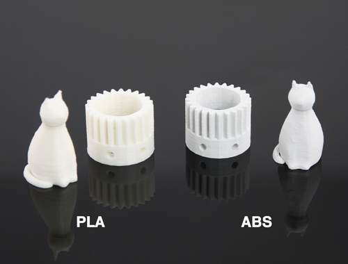
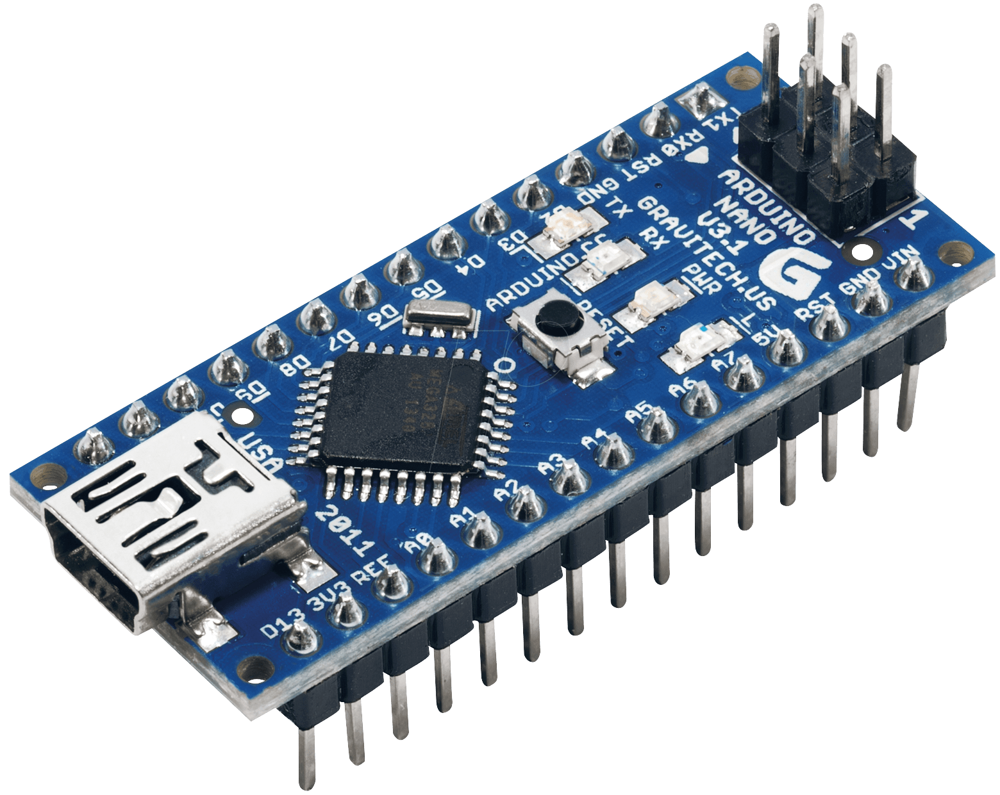
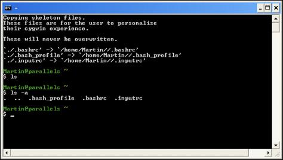
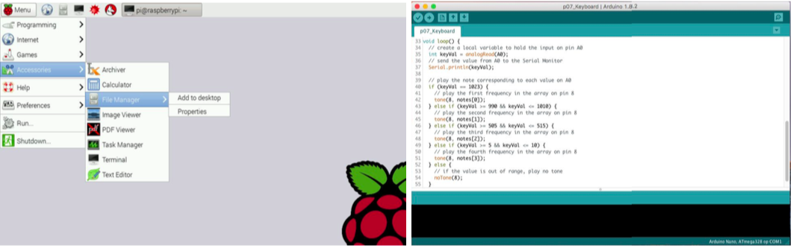
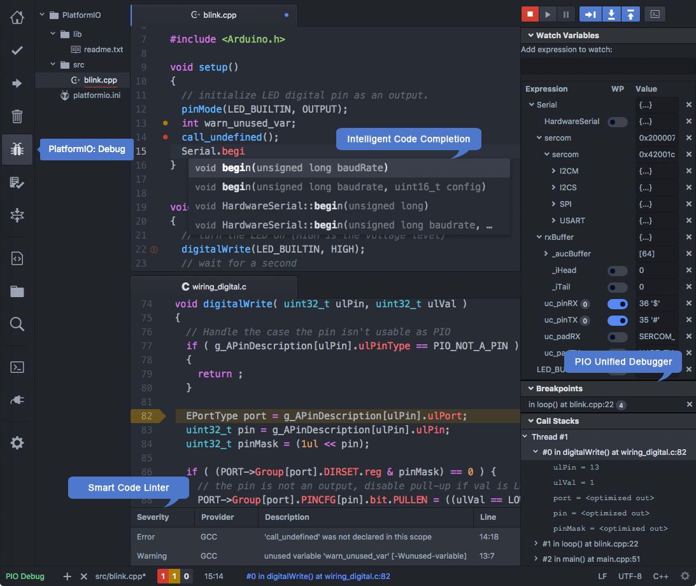
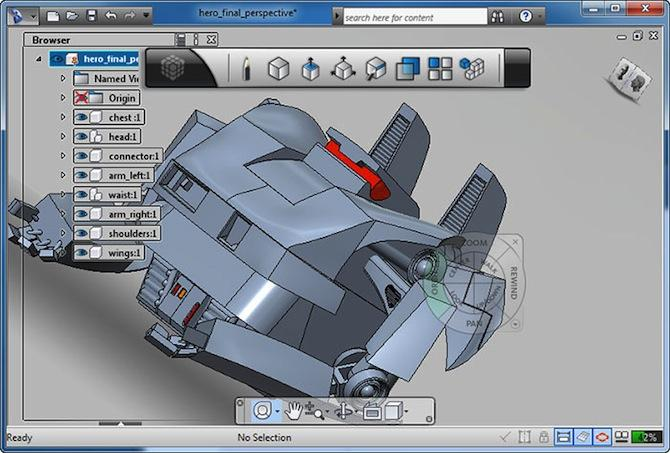

\pagebreak
# Materialen en software
Een hand is erg complex. Een nabootsing van een hand kost dan ook onwijs veel tijd, energie en materialen om te maken. Bij het maken van een prothese moet er veel rekening worden gehouden met de materiaalkeuze. Ook is het beperken van de onderdelen belangrijk.

## Materialen aan de buitenkant van de hand
Bij het kiezen van een printmateriaal, zijn er een paar overwegingen die er moeten worden gemaakt. Je wilt dat het materiaal sterk is. Het moet sterk genoeg zijn om niet zomaar kapot te gaan maar tegelijkertijd zacht genoeg dat je het nog wel bewerkbaar is. Ook moet het 3D printbaar zijn. Dit zijn best wat vereisten voor het materiaal. Het belangrijkste voor ons is dat het 3D printbaar is, omdat het doel is dat de prothese ge-3D-print wordt. De materialen hierin zijn beperkt. ABS is beter hittebestendig en sterker. Het enige nadeel is dat het moeilijker printen is. Volgens @chilson2013.

{ #fig:plaabs width=41%}

## Materialen in de hand
Er is ook ander materiaal nodig voor de prothesehand. Bijvoorbeeld motortjes, draadjes, stroomdraadjes en een microcontroller of microcomputer, deze sturen alles in de hand aan. Er zijn erg veel verschillende motors op de markt. In een prothesehand heeft men deze het liefst zo klein mogelijk, met toch aardig wat kracht. De ruimte is namelijk minimaal en motors nemen al gauw flink wat ruimte in. Ook de draad moet krachtig zijn. Visdraad is erg sterk en dun, wat het een perfect materiaal maakt. De twee meest voorkomende microcontrollers tegenwoordig zijn de Raspberry Pi en Arduino. Dit zijn de enige twee controllers die zijn onderzocht, omdat het grootste marktaandeel uit deze twee controllers bestaat. Raspberry Pi is een microcomputer en past in je handpalm. Arduino heeft ook meerdere microcontrollers met deze grootte, tevens hebben zij ook een nog kleinere microcontroller: de Arduino Nano. Deze is de grootte van een pink. Dit maakt haar de perfecte microcontroller voor een prothesehand. Het grote verschil is dat de Nano geen poorten (USB, HDMI…) heeft. Er kunnen dus niet makkelijk USB-apparaten aan worden gekoppeld. Alles moet hierdoor via pins, de metalen pinnetjes aan de onderkant in @fig:nano.

{ #fig:nano width=36%}

## Software
De software voor het productieproces wordt vooral bepaald door de microcontroller. Vaak is een bepaalde microcontroller afhankelijk van één programmeertaal en met een bepaald ontwikkelproces uitgedacht. Om het simpel te houden gaat het nu verder in op de twee meest voorkomende microcontrollers: de Raspberry Pi en de Arduino.

De Raspberry Pi is een microcontroller die draait op een speciale versie van Linux (een open source [^os] besturingssysteem), genaamd Raspbian. Dit besturingssysteem of operating system (OS) is speciaal ontwikkeld voor de Pi , zie @raspbian. Gezien het feit dat het een Unix-systeem is, werk je vooral met de terminal. Een herkenbaar aspect van een dit systeem is de centrale rol van het bestandssysteem @unix. Om met dit bestandssysteem te werken maakt men gebruik van kleine programma’s die gecombineerd worden in een shell (@fig:shell). Unix wordt vaak geassocieerd met een ‘Command Line Interface’. Dit betekent dat de computer wordt bestuurd met korte getypte opdrachten in plaats van het klikken op knoppen en slepen van bestanden.

[^os]: Software waarvan iedereen toegang heeft tot het bronmateriaal (de ‘source’).

{ #fig:shell width=55%}

Verder ziet de Raspberry Pi er uit als een normale Windows computer, met een bureaublad, applicaties, een browser en een dock. Over het algemeen programmeer je Raspberry Pi’s in Python. Dit is een in Nederland ontwikkelde programmeertaal met een erg overzichtelijke syntax.

De Arduino is daarentegen geen microcomputer, maar een microcontroller , dit verschil wordt beschreven in @justo2015. Dit verschil uit zich in het niet hebben van een user interface (UI), te zien in @fig:rpide. Als men een Arduino dus via een hdmi-kabel aan een extern beeldscherm hangt, gebeurt er niks. Een Arduino is enkel bedoeld voor dingen als robotica en home automation (het automatisch besturen van elektronische onderdelen van je huis). De Arduino is daarentegen wel weer erg simpel in gebruik, vooral gecombineerd met de Arduino IDE [^ide] (@fig:rpide) (gebaseerd op Processing) en de Arduino programmeertaal (gebaseerd op Wiring, @arduino2017). Doordat de software, programmeertaal en hardware zo op elkaar is afgestemd, gaat het proces een stuk makkelijker over het algemeen.

[^ide]: Integrated Development Environment; de software die men gebruikt om software te ontwikkelen.

{ #fig:rpide width=100% }

Voor programmeren is een goede, functionele IDE erg handig. Dit is software om het ontwikkelen van software te vereenvoudigen. Een veelgemaakte keuze hiervoor is de Atom text editor , te vinden in de opsomming van @henry2014. Dit is enkel een text editor, maar door de vele packages die downloadbaar zijn, is Atom inmiddels volledig om te bouwen tot uitgebreide IDE. Atom is ontwikkeld door Github, en daarom ook volledig open source. Echter is Atom nog niet gebouwd voor microcontrollers, zoals de Arduino IDE is. Hiervoor zijn packages beschikbaar. PlatformIO, ontwikkeld door @kravets2017, is hier een van. Deze voegt verschillende tools en packages toe die het programmeren van een microcontroller een stuk makkelijker maken. Zo kan men builden (de code testen op fouten en omzetten naar C++) en uploaden (van de computer naar de geheugenkaart van de microcontroller plaatsen), rechtstreeks  vanuit Atom. Atom met deze package is te zien in @fig:atom.

{ #fig:atom width=60%}

Het ontwerpen van 3D-afbeeldingen van de hand vereist ook speciale software. Hiervoor zijn er erg veel verschillende applicaties, de meest gebruikte zijn opgesomd in @duann2012. Zo zijn er computerapplicaties, maar ook webapplicaties. Deze applicaties hebben wat weg van Adobe Photoshop. Het zijn over het algemeen programma’s met veel tools, zoals te zien is in @fig:123d. Ook hebben deze programma’s vaak voorontworpen basisvormen, om het productieproces te versnellen. Het kunnen zowel desktop applicaties als webapps zijn. Een voorbeeld van een webapp hiervoor is Tinkercad. Het doel van Tinkercad is het ontwerpen van 3d-afbeeldingen zo eenvoudig mogelijk te maken. Tinkercad is dan ook geen complexe, professionele tool. Toch valt hier bijna alles mee te maken.  

{ #fig:123d width=70%}
