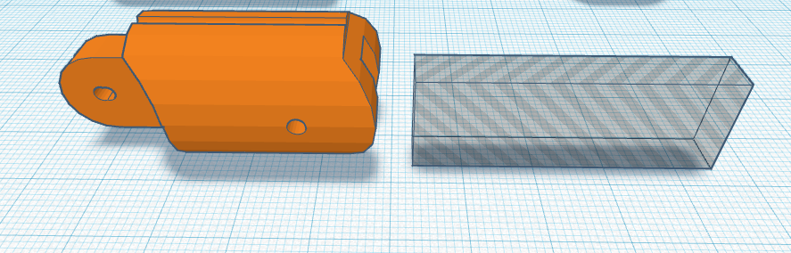
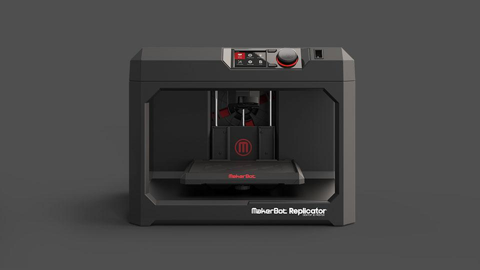
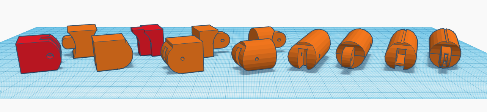
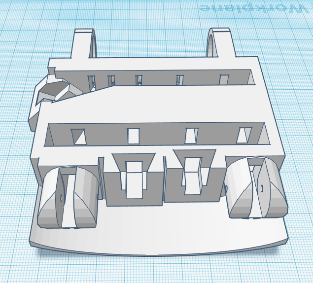

# Ontwerpen en printen
De meest voor de hand liggende optie voor ons was Tinkercad [^tc]. Dit is een webapplicatie en hierdoor op elke computer met een internetverbinding te gebruiken. Het ontwerpen gaat door bepaalde vormen aan je document toe te voegen en die te vervormen. Bepaalde vormen kunnen ook in negatieve stand, waardoor die vorm uit de andere vorm gehaald kan worden.

[^tc]: https://tinkercad.com

{ #fig:tinkercad width=72% }	   

Voor het printen hebben wij de MakerBot Replicator (@fig:makerbot) gebruikt. Dit is een desktop 3d printer met een applicatie voor de Mac. Bij deze printer zijn er heel veel instellingen te veranderen, iets dat wij dan ook uitgebreid hebben gedaan. Hiervoor hadden wij een preset gemaakt waarin instellingen zoals de laagdikte, reissnelheid van de kop, printtemperatuur en dikte ondersteuningsstructuur ingesteld staan.  

{ #fig:makerbot width=55% }

In de loop van de tijd zijn wij meerdere problemen tegengekomen in het ontwerp, deze hebben we telkens opgelost door zowel grote als kleine aanpassingen te maken. Zo had de eerste versie van de vinger nog geen ruimte in de binnenkant voor de mechaniek (het visdraad). Dit proces is ge&#239;llustreerd in @fig:middenkootje.

Bij het ontwerp hebben we ook rekening gehouden met de verhouding van Fibonacci, de "gulden snede". Door deze reeks te gebruiken hebben we geprobeerd een hand te maken die zoveel mogelijk overeenkomt met een normale mensenhand.

{ #fig:middenkootje width=100% }

Na het printen van een deel van de vingers of van de palm zagen wij steeds weer nieuwe leermomenten. Nadat wij deze dan fouten hadden gezien gingen wij bespreken hoe wij het dan beter hadden kunnen doen of welke printinstellingen wij moesten veranderen. Hierdoor ontwikkelde ons ontwerp steeds meer met de tijd en hebben wij uiteindelijk ons uiteindelijke product kunnen ontwerpen en printen.

Op de plek waar alle vingers bij elkaar komen, de handpalm, trad een nieuw probleem op. Je kan immers niet de binnenste twee vingers vastzetten, aangezien het koppelstuk van de buitenste twee vingers hierbij in de weg zat. Om deze twee te kunnen plaatsen moesten wij een schuifmechanisme bedenken dat stevig genoeg zou zijn dat het niet los zou schieten, maar ook makkelijk te verwijderen is, aangezien je alleen op deze manier de vingers aan de knokkels vast kon maken met een pin.

{ #fig:palm width=44%}

In @fig:palm kun je zien dat de vingers met pinnetjes aan de knokkels vast worden gemaakt en dat dat niet mogelijk zou zijn bij de ring- en middelvinger als deze niet verwijderd konden worden.
