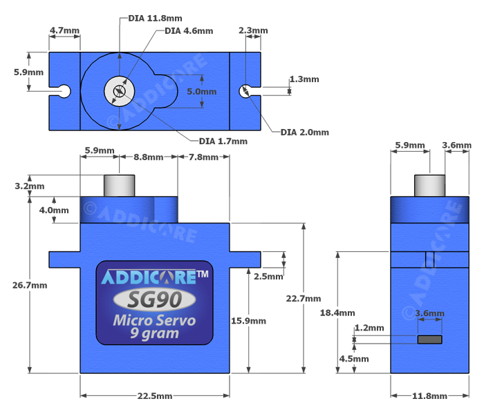
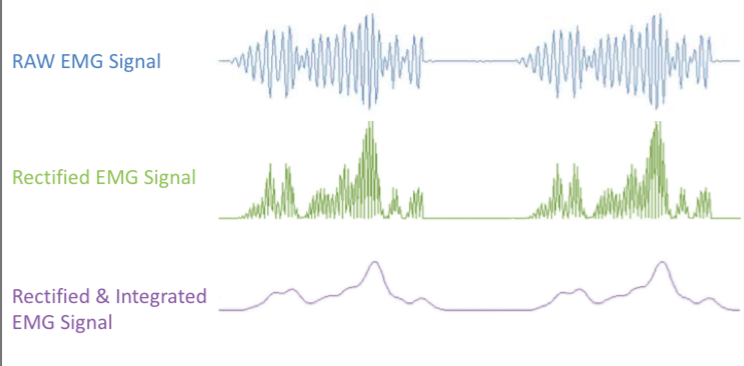
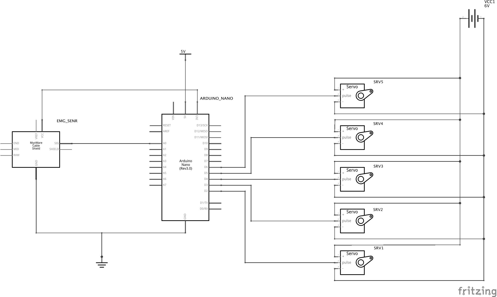
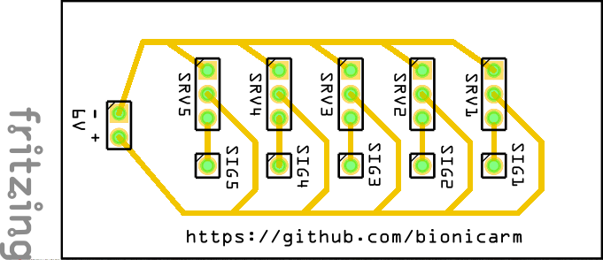

\pagebreak
# Elektronica
Het programmeren was erg afhankelijk van de hardware keuzes. Als microcontroller hebben we uiteindelijk gekozen voor de Arduino Nano. Toen wij begonnen met ons te verdiepen in het onderwerp, raakten we steeds meer bekend met de Raspberry Pi. Toch ontdekten we later dat dit niet de beste microcontroller is voor een prothesehand. Omdat dit een microcomputer is, en dus geen microcontroller, is het veel ingewikkelder om ons project ermee uit te werken. Ook is de Raspberry Pi vrij groot. Het voordeel aan de Raspberry Pi is wel dat je hiermee veelal Python scripts runt. Deze taal beheersten we alledrie al vrij goed, in tegenstelling tot C++, waar Arduino op gebaseerd is.

Er zijn veel verschillende soorten microcontrollers van Arduino. Wij hebben hierbij voor de Nano gekozen, aangezien deze erg klein is. Toch bezit deze controller genoeg pins [^pins] om alles op aan te sluiten. Ook de Arduino programmeren gaat gepaard met groot gebruiksgemak: Je schrijft wat code op je computer, *upload* deze code naar de Arduino met de IDE en de Arduino blijft deze code uitvoeren @vervloesem2017.

[^pins]: Een bepaald soort aansluiting bij elektronica; kleine geleidende pinnetjes.

## Clone
Arduino is geheel open-source. Dit betekent dat alle broncode vrij op het internet beschikbaar is. Deze vrijheid zorgt ervoor dat er vele clones [^clones] van de Arduino controllers bestaan. Dit zijn, veelal chinese, namaak Arduino’s. Hierdoor zijn er Arduino’s die worden verkocht voor ongeveer één vierde van de originele prijs. Er zijn echter niet alleen maar voordelen. De Nano die wij hadden gekocht had een OEM driver [^driver] voor de CH34X chipset. Dit is een andere driver/chipset dan het origineel. Dit zorgde er helaas voor dat de Arduino crashte in combinatie met macOS. Hierdoor komt de Arduino niet tussen de beschikbare apparaten te staan. Dit is nodig voor het programmeren, meer hierover in §3.3. Na wat zoeken op het internet kwamen wij op een repository [^repo] van Adrian Mihalko. Hij omschrijft het probleem als volgt: "*Version 1.3 (...) of the OEM driver for the CH34x chipset currently causes a kernel panic (a.k.a. crash) when installed on macOS Sierra.*" @mihalko2017. Hij heeft dit opgelost door een bestandje, dat standaard zit inbegrepen bij macOS, te herschrijven. Hierdoor werd onze clone weer herkend door Mac computers.

[^clones]: Precies nagemaakte Arduino controllers.
[^driver]: Een driver of stuurprogramma legt een verbinding tussen de hardware en het besturingssysteem.
[^repo]: Een pagina op Github.com met open-source code.

## Overige hardware
Natuurlijk heb je nog veel meer hardware nodig om een hand uiteindelijk te laten bewegen. Bijvoorbeeld de motortjes. Deze zijn grofweg in drie categorieën in te delen: DC-motoren, stappenmotoren en servomotoren.

Een DC [^DC] draait continu zo lang als er stroom op staat. Ze zijn tweedradig (power en ground) en draaien meestal met een hoog RPM [^RPM].

[^DC]: DC = Direct Current.
[^RPM]: RPM = Revolutions Per Minute. Het aantal rondjes per minuut die de motor draait.

Een stappenmotor werkt een stuk ingewikkelder, met meerdere elektromagneten die om een centraal tandwiel staan. De stappenmotor werkt in stapjes, en is dus erg precies te besturen. Het RPM is een stuk lager dan bij een DC-motor, maar de torque (draaikracht) is erg hoog. Een stappenmotor is echter wel vijfdradig.

Een servo is een snelle, precieze elektromotor. Meestal kan deze maar in 180 graden bewegen. Werkt ongeveer hetzelfde als een stappenmotor. @modmypi2013

Wij hebben uiteindelijk gekozen voor de servomotor omdat deze het best bij een robotarm past. De motor beweegt snel, heeft maar een verbinding naar de Arduino en heeft genoeg torque. Echter is het allerbelangrijkste aan servomotoren dat ze feedback naar de Arduino kunnen sturen. We kunnen dus weten in welke positie hij staat. Dit is belangrijk bij het aansturen van de motor. Als deze bijvoorbeeld al volledig naar rechts is gedraaid, kunnen we niet nogmaals de opdracht geven om verder naar rechts te draaien. In ons geval zou de vinger dan door buigen. Wij zijn uiteindelijk gekomen op de SG90. Dit is een zeer kleine, maar krachtige servomotor. Deze motor is hieronder afgebeeld, met de bijbehorende dimensies.

{ #fig:servo width=40% }

## Het aansturen van de hand
Zoals omschreven in de theorie, is het mogelijk om de hand aan te sturen door het kijken naar elektrische signalen in de armspieren. Dit wordt gedaan met behulp van een EMG sensor. Een voorbeeld van een EMG sensor is de MyoWare Muscle Sensor van Sparkfun. Deze kleine sensor is zeer eenvoudig in gebruik en gemaakt voor microcontrollers.

Bij het plaatsen van deze sensor is het belangrijk hoe deze geplaatst wordt. De sensoren moeten in het midden van de spier en in dezelfde richting als de vezels zitten.

De output van de sensor is echter geen ruw EMG signaal. Het is versterkt en de vele korte pieken zijn samengetrokken @advancer2015. Dit verschil is ge&#239;llustreerd in @fig:emg, waar raw al versterkt is, rectified rechtgetrokken is en integrated de samengetrokken pieken zijn.

{ #fig:emg width=54% }

Ook de bedrading en signaalgeving werkt erg goed bij de MyoWare. Er zijn maar drie draden voor nodig: `V+` [^v+], `SIG` [^sig] en `GND` [^gnd].

[^v+]: V+ geeft de stroomtoevoer weer.
[^sig]: SIG geeft de signaaldraad weer. Hierdoor loopt het signaal van de sensor naar de microcontroller.
[^gnd]: GND is de ground. Dit is de stroomafvoer.

## Elektriciteitsschema
Voor je begint met het werken met circuits, is het belangrijk dat de stroomkringen altijd goed uitgedacht zijn. Als dit niet het geval is, kan er bijvoorbeeld kortsluiting optreden. Het is hierom dan ook belangrijk om een elektriciteitsschema van te voren te maken. Dit deden wij met Fritzing. Fritzing is een gebruiksvriendelijke applicatie voor het maken van zulke schema’s. Fritzing ondersteunt drie verschillende soorten weergaves: Breadboard, Schematic en PCB. Breadboard is erg visueel. Je gebruikt hier dan ook getekende versies van echt bestaande onderdelen. Bij de Schematic view is dit heel anders. Schematic view geeft, zoals de naam al zegt, een schematische weergave de stroomkring. Breadboard wordt gebruikt voor het maken van prototypes, schematische weergave kan zowel bij prototypes als bij het uiteindelijke gesoldeerde product gebruikt worden.

De stroomkring van onze prothesehand zag er dan als volgt uit:

{ #fig:stroom width=65% }

Een grotere versie van dit elektriciteitsschema is te vinden in de bijlage (@fig:ee).

In het schema is te zien dat de MyoWare sensor verbonden is aan de Arduino. Er komt stroom in vanaf de `3V3` pin van de Arduino. Vervolgens geeft de sensor signaal af aan Arduino pin `A0`. De Arduino en sensor hebben een gemeenschappelijke ground. Vijf digitale pins (`D2`-`D6`) geven signaal af aan de vijf servomotoren. Deze hebben een losse stroomkring, van 6 volt. Dit wordt geleverd door vier in serie geschakelde AA batterijen. De 5 servomotoren zijn aan de Arduino en bronspanning gekoppeld via een zelf ontworpen printplaat. Dit is eigenlijk een soort driver voor de servo’s.

{ #fig:servodriver width=58% }
