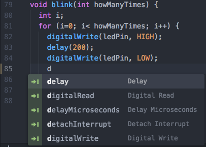
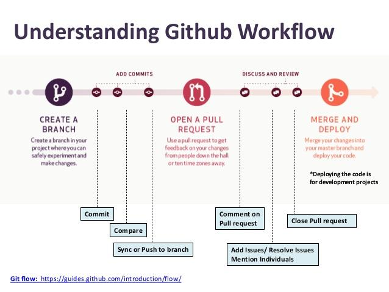

\pagebreak
# Programmeren
Nu we weten dat we gaan programmeren in de arduino-taal, de Nano volledig naar toebehoren werkt en de juiste hardware binnen is, kunnen we beginnen met programmeren. Hierin liepen we echter ook tegen belangrijke keuzes en vele leermomenten aan. In deze paragraaf wordt beschreven hoe dit proces te werk ging, en wat we daarvoor nodig hadden.

## Ontwikkelingsomgeving
Wij hebben ervoor gekozen om de Arduino IDE niet te gebruiken in ons ontwikkelproces. De IDE van Arduino mist vele functionaliteiten die het ontwikkelen net iets makkelijker maken. Zo kun je bijvoorbeeld maar aan een bestand werken en mist het een terminal. Maar het allerbelangrijkste, er is geen autocompletion. Dit zorgt ervoor dat je maar een deel van de functie hoeft te typen, zoals te zien in @fig:autocomplete. Dit werkt sneller en zorgt voor een kleinere kans op kleine structuurfouten.

{ #fig:autocomplete width=43% }

Toch miste Atom een aantal belangrijke functies voor gebruik bij robotica projecten. Zo is er geen seriële monitor (voor de tekst output van de Arduino), geen compiler (de arduino-code omzetten in C++ code) en is het niet mogelijk direct te builden en uploaden vanuit Atom. Dit zou betekenen dat je eerst alle code in de Arduino IDE zou moeten plakken, om het vanuit daar te uploaden. Gelukkig is hier een package voor, genaamd PlatformIO. Dit voegt al deze functies, en nog veel meer, toe aan Atom. Hier is nog een kleine toevoeging voor nodig, voor het builden en uploaden naar de Arduino, naar de omschrijving van de ontwikkelaar @fatsi2015. Dit is mogelijk als de Arduino is aangesloten en de computer hem herkent. Bij dit proces wordt de code vanaf de computer naar de Arduino geladen.

Nu is Atom helemaal klaar voor ons project, met volledige functionaliteit.

Om optimaal gebruik te maken van PlatformIO, moet je aan een bepaalde folder structuur voldoen. Zo moeten er bepaalde bestanden aanwezig zijn, en moeten bijvoorbeeld alle libraries [^bib] in de map `lib/` staan.

[^bib]: Bibliotheken: een verzameling algemene functies/routines, waardoor je geen nieuwe code hoeft te schrijven voor iets dat erg algemeen is of vaak voorkomt. Je hoeft alleen de library aan te roepen.

## Versiebeheersysteem
Wij hebben alle code met behulp van een version control system (VCS) geschreven. Hierdoor kan een van ons drieën een nieuwe functie of verbeterde code probleemloos toevoegen. Dit kan dan herzien worden, alvorens het vanuit een zijtak in de hoofdtak kan worden samengevoegd. Een completere beschrijving van dit proces is te zien in @fig:github. Dit zorgt ervoor dat er niet per ongeluk foutieve code geupload wordt, en de oudere versies dan overschreven worden. Dit werkt bijvoorbeeld zo bij Dropbox of een andere cloud opslag service. Door deze manier van werken is al onze broncode ook volledig open-source, evenals alle andere bestanden die met dit project te maken hebben. Deze zijn te vinden op onze Github pagina, [https://github.com/bionicarm/bionicarm](https://github.com/bionicarm/bionicarm).

{ #fig:github width=65% }

## Toelichting op code
Bij het schrijven van arduino-code maak je altijd gebruik van twee verplichte functies: `void setup() {}` en `void loop() {}`. Zoals de naam misschien al verhult, gebruik je de setup functie om alles in op te zetten en de pins hun taak te geven. De loop functie is vervolgens het deel dat continu (in een ‘loop’) gaat lopen. Dit blijft net zolang doorgaan als dat er stroomtoevoer is. Dit ziet er als volgt uit:

```
void setup() {
	// Hier plaats je alle setup-code
}

void loop() {
	// En hier alles dat uitgevoerd moet worden
}
```

Voor het gebruik van servomotoren heb je de Servo bibliotheek (library) nodig. Deze plaatsten we in `lib/Servo-master`, hierdoor konden we in het arduino-bestand er makkelijk naar verwijzen. Daarna moeten de motoren worden geïnitialiseerd met behulp van de library. Dit is hieronder te zien.  De structuur bij het gebruiken van een library in Arduino is als volgt: "Library Variabelenaam;".  Hieraan wordt vervolgens in de `setup{}` functie een pinnetje aangekoppeld met `attach()`.

```
#include <Servo.h>

Servo m1;
Servo m2;
Servo m3;
Servo m4;
Servo m5;

// SETUP
void setup() {
  m1.attach(2);
  m2.attach(3);
  m3.attach(4);
  m4.attach(5);
  m5.attach(6);
}
```

Vervolgens kan de motor worden aangestuurd. Bij een servo motor doe je dit met `m1.write(n);` waarin n een getal tussen de 0 en 180 is. Dit komt overeen met het aantal graden die de ring op de motor draait.

Vervolgens hadden we een aantal functies om bepaalde handposities aan te nemen. Zoals bijvoorbeeld een duim opsteken:

```
void thumbsUp() {
  m1.write(0);
  m2.write(180);
  m3.write(180);
  m4.write(180);
  m5.write(180);
}
```

In deze functie staat de duim helemaal uit en de vier andere vingers naar binnen.

De sensor moet ook worden ingesteld in de code. Dit deden wij als volgt:

```
void setup() {
  // Set EMG pin to input
  pinMode(A0, INPUT);
}

void loop() {
  // read value of analog pin 0 and give emg the value
  int emg = analogRead(A0);
}
```

Om nu de handeling met de sensorwaarde te koppelen, werd er gebruik gemaakt van een if-statement in de `loop{}` functie.

```
if (emg < 50) {
    allFingers(700);
} else if (emg > 50 && emg < 200) {
    pinch();
} else if (emg > 700) {
    allFingers(2300);
}
```

Hier bepaald de range van de waarde voor de emg variabele welke functie wordt uitgevoerd. In het geval dat het een bepaald getal is, wordt dat deel van de code uitgevoerd. Zo wordt er bij emg > 700 de functie `allFingers(2300)`; uitgevoerd.

De overige volledige broncode staat in de bijlage, aangevuld met kort commentaar.
