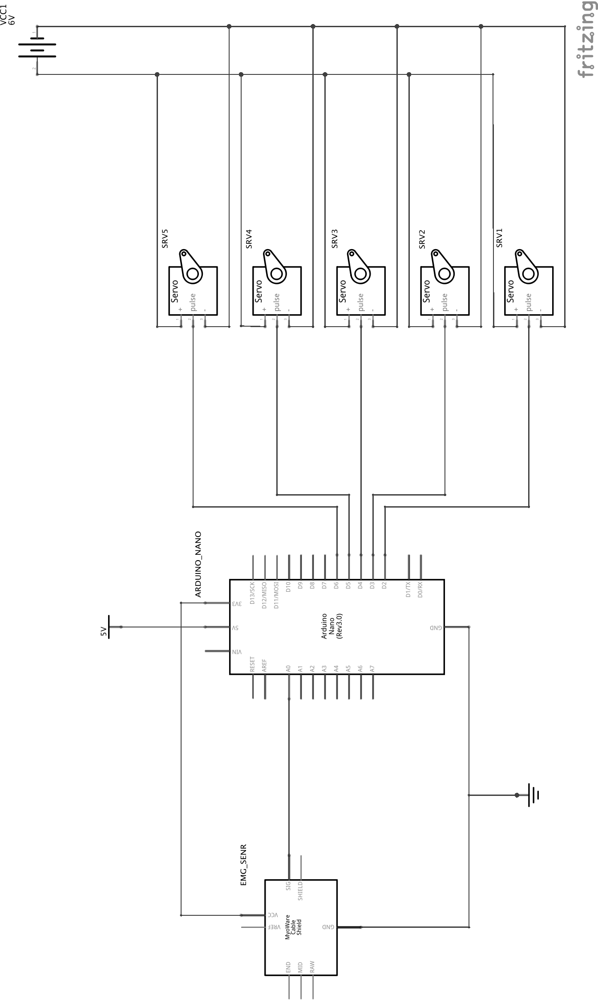
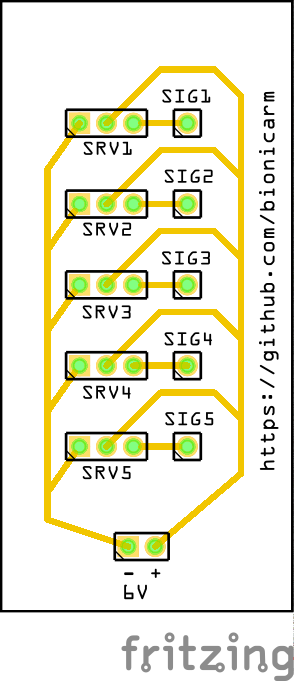

\pagebreak
# Referenties {.unnumbered}

\pagebreak
# Bijlage I {.unnumbered}
{ #fig:ee width=70% }

\pagebreak
# Bijlage II {.unnumbered}
{ #fig:driver width=50% }

\pagebreak
# Bijlage III {.unnumbered}
```
// LIBRARIES //
#include <Servo.h>

// setting up servo's.
// m1 = finger 1 (thumb) etc.
Servo m1;
Servo m2;
Servo m3;
Servo m4;
Servo m5;


// SETUP //
void setup() {
  // Attach servo variables to digital pin 2-6
  m1.attach(2);
  m2.attach(3);
  m3.attach(4);
  m4.attach(5);
  m5.attach(6);

  // Serial monitor for debugging
  Serial.begin(9600);
}


// LOOP //
void loop() {
  // read the analog value of A4 and store it in variable 'emg'
  int emg = analogRead(A4);

  // if statement for defining which muscle activity corresponds
  // with which hand movement
  if (emg < 50) {
    allFingers(700);
  } else if (emg > 50 && emg < 200) {
    pinch();
  } else if (emg > 700) {
    allFingers(2300);
  }

  // delay to give the fingers time to move
  delay(1000);
}

// PRESETS //
void allFingers(int pos) {
  // get all fingers in same position.
  // With our servo's; 700 for open hand,
  // 2300 for fully closed hand
  m1.writeMicroseconds(pos);
  m2.writeMicroseconds(pos);
  m3.writeMicroseconds(pos);
  m4.writeMicroseconds(pos);
  m5.writeMicroseconds(pos);
  delay(100);
}

void pinch() {
  m1.writeMicroseconds(2300);
  m2.writeMicroseconds(2300);
  m3.writeMicroseconds(700);
  m4.writeMicroseconds(700);
  m5.writeMicroseconds(700);
  delay(100);
}

void thumbsUp() {
  m1.writeMicroseconds(700);
  m2.writeMicroseconds(2300);
  m3.writeMicroseconds(2300);
  m4.writeMicroseconds(2300);
  m5.writeMicroseconds(2300);
  delay(100);
}

void middleFinger() {
  m1.writeMicroseconds(2300);
  m2.writeMicroseconds(2300);
  m3.writeMicroseconds(700);
  m4.writeMicroseconds(2300);
  m5.writeMicroseconds(2300);
  delay(100);
}
```
